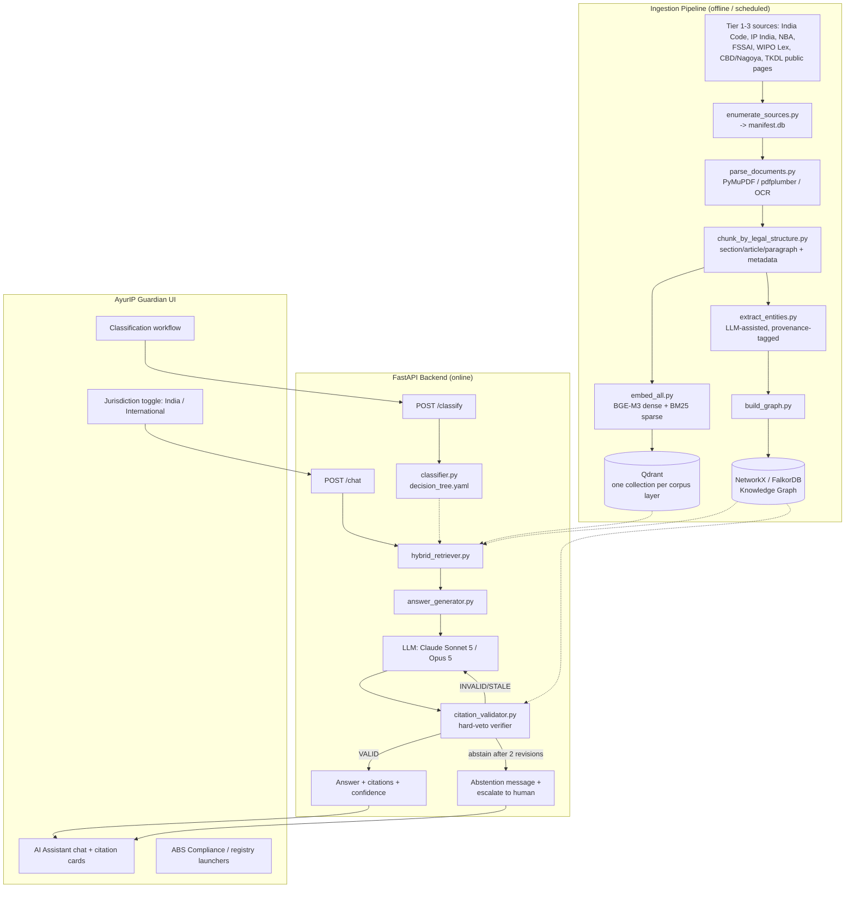
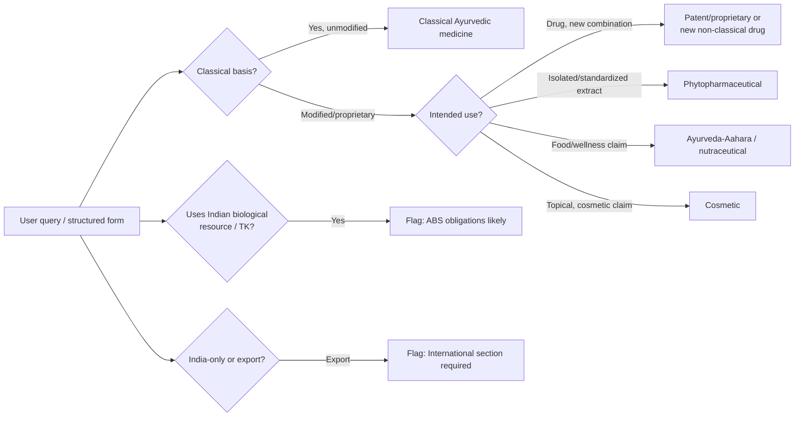
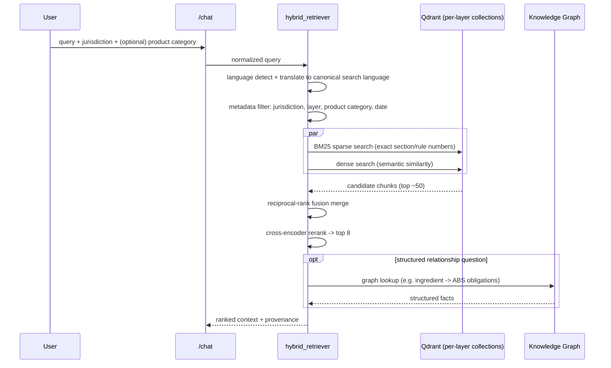

# Design Document — IP-SAKTI Sahayak

Companion to `PRD.md` (what/why) and `TRD.md` (tool choices). This document is the how: system
architecture, data flow, the citation-verification design, and how backend responses map onto
the existing UI mockup.

## 1. High-level architecture



## 2. Design principle: retrieval finds candidates, the graph decides what may be claimed

This is the single most important architectural decision in the system, and it's worth stating
explicitly because it inverts the usual RAG mental model:

> In standard RAG, the knowledge graph (if present) improves *what the model sees*. In IP-SAKTI,
> the knowledge graph constrains *what the model is permitted to claim*.

Concretely: the hybrid retriever's job is recall — get plausible sections, rules, and precedents
in front of the model. The citation validator's job is precision — nothing in the final answer
ships unless a traceable path for it exists in the graph. See #6 for the full mechanism. This
directly implements the brief's own requirement ("do not allow the model to produce a legal
proposition without retrieved evidence") as an enforced architectural gate rather than a prompt
instruction the model can ignore.

## 3. Classification flow (runs before retrieval)



The category output becomes a **hard filter** on retrieval (which corpus layer/authority to
query) and a **routing key** in the knowledge graph (`ProductCategory —REQUIRES_LICENSING_FROM→
Authority`). It is authored/curated metadata (`classification/decision_tree.yaml`), not something
inferred fresh by the LLM each time — see `DATA_ORGANIZATION.md` #4 for why this must be
expert-reviewed rather than scraped.

## 4. Hybrid retrieval pipeline



Query normalization runs even for English-only Stage-1 queries because Indian-language legal
terms (e.g. "ashwagandha", "kwatha") and mixed-script queries are the norm, not the edge case,
in this domain.

## 5. Citation-grounded generation (the abstention machine)

```mermaid
flowchart TD
    A[Retrieved context + citations] --> B[LLM draft answer\nJurisdiction-specific template]
    B --> C[citation_validator.py]
    C --> D{Every claim has\na traceable graph path?}
    D -->|VALID| E[Return answer\n+ citation chain + confidence]
    D -->|INVALID: citation not in graph| F{Revision attempts < 2?}
    D -->|STALE: statute repealed/superseded| F
    D -->|CONFLICT: unresolved doctrinal split, Stage 2+| G[Return answer WITH\nconflict flag, both sides, low confidence]
    F -->|Yes| H[Send rejection reason back to LLM,\ninstruct: cite only verified sources]
    H --> B
    F -->|No| I[ABSTAIN:\n\"I could not verify this proposition\nfrom the indexed authoritative sources.\nPlease consult an IP professional...\"]
```

### 6. Why a hard veto, not a confidence penalty

This design is adapted from a 2026 Indian-judicial-AI research pattern (graph-constrained
generation with a "Verifier Agent" acting as a falsifiability oracle over a case-law knowledge
graph). The core insight transfers directly to IP-SAKTI even though our Stage 1 graph covers
statutes/rules/authorities rather than case law:

- A claim with no supporting path in the graph is not a *low-confidence* claim — it has **no
  grounding at all** in the ingested corpus. Treating it as "answer anyway, but flag low
  confidence" lets ungrounded claims reach the user with a softened warning attached, which is
  exactly the failure mode this product exists to prevent.
- The hard veto is therefore: **no traceable path → the claim does not ship**, full stop. The LLM
  gets up to two chances to revise using only verified sources; after that, the system abstains
  explicitly rather than degrading gracefully into a plausible-sounding guess.
- **Scope honesty matters**: a VALID verification result means "grounded in the ingested corpus,"
  not "correct as a matter of law in general." The UI must say this (see #7's confidence badge
  copy) — the system makes no claim to have checked against all of Indian/international law,
  only against what's indexed.
- **Stage 2+ (case law, Layer D)**: extend the same pattern with case-law-specific edge types —
  `CITES`, `OVERRULES`, `DISTINGUISHES`, and critically `CONFLICTS_WITH` / `RESOLVED_BY` for
  doctrinal splits. When two cited authorities conflict and no resolution edge exists, **surface
  the conflict as a first-class output** rather than silently picking a side — an honest "this is
  contested, here are both positions" is more useful to a practitioner than a confident answer
  drawn from an unresolved split.

## 7. UI mapping (existing mockup → live data contract)

The static mockup (`frontend/ayurip-guardian-mockup.html`) already encodes the intended UX. The
live backend must fill these exact slots without changing the shape:

| UI element (mockup) | Backend field |
|---|---|
| 🇮🇳 INDIA / 🌍 INTERNATIONAL toggle | `request.jurisdiction` — hard filter, not a prompt hint |
| "Jurisdiction: INDIA" + "Category: Cosmetic (Ayush)" header | `response.jurisdiction`, `response.product_category` (from classifier) |
| "High Confidence" green badge | `response.confidence` tier, derived from citation_validator status (VALID=high, revised-once=medium, abstained=n/a) |
| Executive Summary | `response.summary` — one short paragraph, plain language |
| "Legal Position" card | `response.legal_position` — the directly-supported claims |
| "Exemptions Not Applicable" / secondary card | `response.caveats` — reasoned-interpretation or scope-limiting notes |
| Citation block ("Section 3(e) and 3(p)...") | `response.citations[]` — title, authority, section, date, URL |
| "Talk to an Expert" button | Always visible; becomes primary CTA when `response.escalate = true` |

Do not let the live implementation regress the mockup's core promises — **source grounded,
jurisdiction aware, citation based, multilingual, human expert escalation** — those five
badges on the mockup's homepage are effectively the product's acceptance criteria in one line
each.

## 8. API contract (MVP)

```
POST /classify
  body: { free_text?: string, answers?: { q1_classical_basis: bool, ... } }
  returns: { category: string, flags: { abs_likely: bool, export_required: bool } }

POST /chat
  body: { query: string, jurisdiction: "india" | "international", country?: string,
          product_category?: string, language?: string }
  returns: {
    jurisdiction: string,
    product_category: string | null,
    sections: {
      india?: { summary, legal_position, caveats, citations[] },
      international?: { summary, legal_position, caveats, citations[] },
      assumptions: string[],
      when_to_consult_a_professional: string
    },
    confidence: "high" | "medium" | "unverified",
    escalate: boolean,
    abstained: boolean
  }

GET /registry-search?query=&registry=inpass|gi|wipo-brand
  returns: { redirect_url: string, note: string }   // link-out, never bulk-scraped content
```

## 9. Data flow ownership summary

| Concern | Owner module |
|---|---|
| What sources exist, versioning, access tier | `corpus/manifest/` |
| Turning sources into searchable chunks | `ingestion/` |
| Turning chunks into vectors | `ingestion/embed/` |
| Turning structured facts into a graph | `knowledge_graph/` |
| Finding candidate evidence | `retrieval/` |
| Deciding what evidence maps to what product category | `classification/` |
| Drafting and verifying the answer | `generation/` |
| Everything user-facing | `backend/` + `frontend/` |
